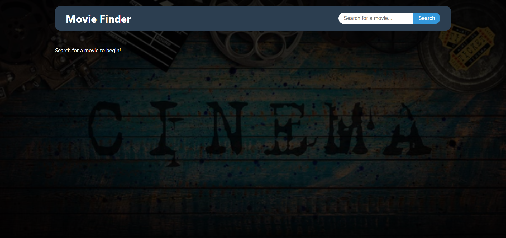
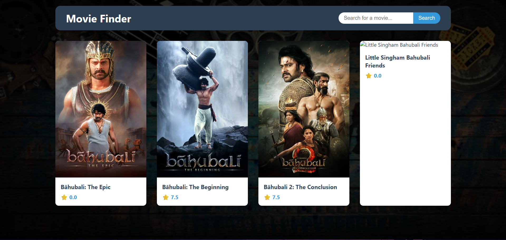
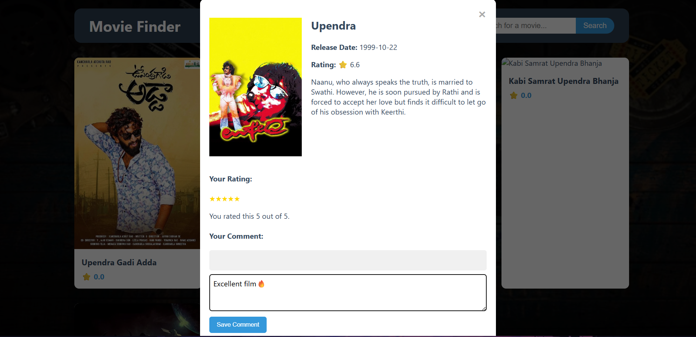

# 🎬 Movie Rating Platform

A responsive web application for searching, discovering, and rating movies, built with modern front-end technologies. This project allows users to search for movies via the TMDb API, view detailed information, and save their own ratings and comments locally.


### 🚀 Live Demo

You can access the live, deployed application here:

**[https://movie-review-rating-platform.netlify.app/](https://movie-review-rating-platform.netlify.app/)** 

---

## 📸 Screenshots


**Main Search Page**


**Search Results Page**


**Movie Details & Review Modal**


---

## ✨ Features

-   **Dynamic Movie Search:** Instantly search the entire The Movie Database (TMDb) library.
-   **Detailed Movie Information:** Click on any movie to view its poster, release date, rating, and overview in a clean, animated modal.
-   **Persistent Ratings:** Rate movies on a 5-star scale. Your ratings are saved in the browser's local storage.
-   **User Comments:** Add personal notes or reviews for any movie, which are also saved locally.
-   **Responsive Design:** A mobile-first design that looks great on desktops, tablets, and phones.
-   **Component-Based Architecture:** Built with reusable and maintainable React components.

---

## 🛠️ Technologies Used

-   **Front-End:** [React.js](https://reactjs.org/), JavaScript (ES6+), CSS3
-   **Build Tool:** [Vite](https://vitejs.dev/)
-   **Deployment:** [Netlify](https://www.netlify.com/)
-   **API:** [The Movie Database (TMDb) API](https://www.themoviedb.org/documentation/api)

---

## 🚀 Setup and Installation

To run this project locally, follow these steps:

1.  **Clone the repository:**
    ```bash
    git clone [https://github.com/Rudrateja123/Movie-Rating-Platform.git](https://github.com/Rudrateja123/Movie-Rating-Platform.git)
    ```

2.  **Navigate to the project directory:**
    ```bash
    cd Movie-Rating-Platform
    ```

3.  **Install dependencies:**
    ```bash
    npm install
    ```

4.  **Set up your Environment Variable:**
    -   Create a new file in the **root** of the project directory named `.env`.
    -   Inside the `.env` file, add your TMDb API key. The variable name **must** start with `VITE_`.
        ```
        VITE_API_KEY="YOUR_TMDB_API_KEY_HERE"
        ```

5.  **Start the development server:**
    ```bash
    npm run dev
    ```

The application will now be running on `http://localhost:5173`.

## 📄 License

This project is licensed under the MIT License.