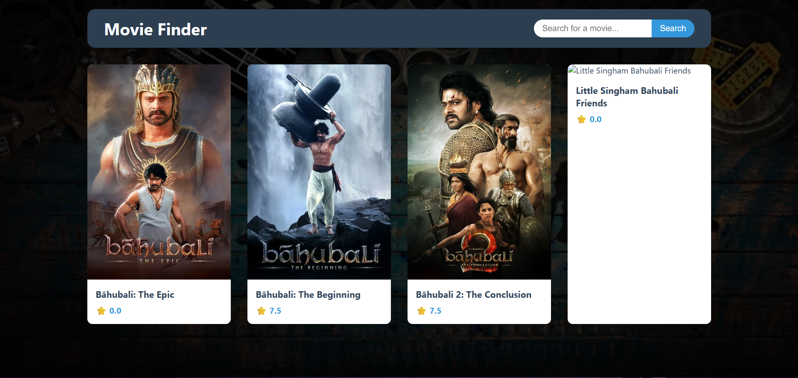
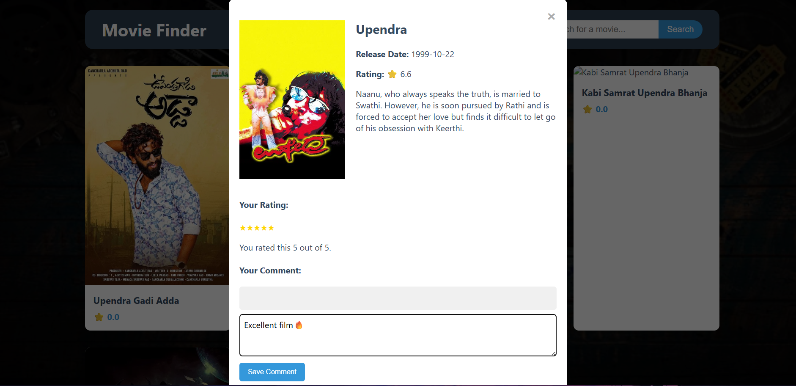

# 🎬 Movie Review & Rating Platform

A responsive movie discovery web app built with HTML, CSS, and vanilla JavaScript. It uses the TMDB API to fetch movie data, allowing users to search for films, view details, and save personal ratings and comments to their browser's `localStorage`.

---


### 📸 Screenshots

**Main Search Page**


**Movie Details & Review Modal**



---

### ## 🚀 Features

* **Movie Search:** Search for any movie using The Movie Database (TMDB) API.
* **Detailed View:** Click on any movie to see more details like release date, rating, and a full synopsis.
* **Star Ratings:** Rate movies on a 5-star scale.
* **Personal Comments:** Add your own comments and reviews for any movie.
* **Persistent Storage:** Your ratings and comments are saved in your browser's `localStorage`.
* **Responsive Design:** A clean, modern UI that works beautifully on all screen sizes.

---

### ## 💻 Technologies Used

* **HTML5**
* **CSS3** (Flexbox & Grid)
* **Vanilla JavaScript (ES6+)**
* **[The Movie Database (TMDB) API](https://www.themoviedb.org/documentation/api)** for movie data
* **[GitHub Pages](https://pages.github.com/)** for deployment

---

### ## 🛠️ Setup and Local Installation

To run this project on your local machine, follow these steps:

1.  **Clone the repository:**
    ```bash
    git clone [https://github.com/Rudrateja123/Movie-Review-Rating-Platform.git](https://github.com/Rudrateja123/Movie-Review-Rating-Platform.git)
    ```

2.  **Get an API Key:**
    * Visit [TMDB](https://www.themoviedb.org/) and create a free account.
    * Go to your account settings and request an API key.

3.  **Create a `config.js` file:**
    * In the main project folder, create a new file named `config.js`.
    * Add the following code to it, replacing `'YOUR_API_KEY_HERE'` with the key you just received:
        ```javascript
        // config.js
        const API_KEY = 'YOUR_API_KEY_HERE';
        ```

4.  **Open the project:**
    * Simply open the `index.html` file in your web browser.

---

### ## 📜 License

This project is licensed under the MIT License. See the [LICENSE](LICENSE) file for details.